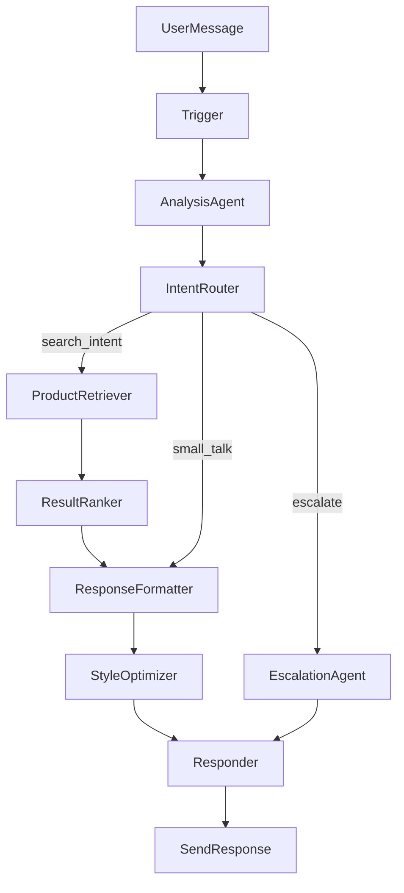

# Generic AI-First Multi-Agent Chatbot Architecture

## 🏗️ System Overview

This project is a **generic, AI-first, workflow-driven sales chatbot engine**. The current example is a **MotorShop 2nd-hand bike assistant**, but the entire architecture is **domain-agnostic** and can be configured for any product type (motorcycles, electronics, furniture, etc.):

- **JSON workflow (`workflow.json`)** drives all domain-specific logic (similar to n8n)  
- **Workflow engine (`workflow-engine.js`)** is completely generic; it just executes the JSON  
- **Multi-agent pipeline**: Analysis → Routing → Retrieval → Ranking → Response
- **Central AI registry (`ai-registry.js`)** manages models, roles, and tool access
- **Config-driven agents**: All intents, entities, and prompts come from workflow config
- **Generic product search**: Works with any `Product` table structure
- **Multi-modal**: hooks for image (Vision) and voice (Whisper) flows  
- **Agent escalation**: routes to human when confidence is low or user asks  
- **Token optimization**: small prompts, strict temperatures, response optimizer  

The MotorShop use case is implemented purely via:
- Seed data in `Product` (`category: "Motorcycle"`, features in JSON)  
- Domain prompts + templates in `workflow.json` (no motorcycle-specific logic in JS)

## 📊 High-Level Flow



### Pipeline Stages

1. **Analysis** (`AnalysisAgent`) - Intent classification, entity extraction using config-driven schema
2. **Routing** (`AnalysisRouter`) - Slot-based routing (budget/area/model) to appropriate handlers
3. **Retrieval** (`SearchAgent`) - Generic product search based on config (category, filters)
4. **Ranking** (`SearchAgent.handleML`) - AI-powered product ranking with reasoning
5. **Response** (`ResponseAgent`) - Template-based formatting and optimization

## 🔄 Multi-Agent Architecture

### Agent Roles (from `ai-registry.js`)

- **ANALYZER** (`gpt-4o`) - Intent classification, entity extraction
- **RANKER** (`gpt-4o-mini`) - Product ranking and relevance scoring
- **OPTIMIZER** (`gpt-4o-mini`) - Response style optimization
- **ESCALATOR** (`gpt-4o-mini`) - Agent escalation handling
- **VISION** (`gpt-4o`) - Image analysis
- **SPEECH** (`whisper-1`) - Voice transcription

All model assignments, temperatures, and max tokens are centralized in `src/config/ai-registry.js`.

### Agent Pipeline

```
User Message
  ↓
1. AnalysisAgent (gpt-4o)
   - Reads intents/entities/system_prompt from workflow.json
   - Extracts intent, entities, language, confidence
   - Outputs standardized schema
  ↓
2. AnalysisRouter (slot-based)
   - Detects filled/missing slots (budget, area, model)
   - Routes to search or clarification based on slots
   - Profile-agnostic (works for any product domain)
  ↓
3. SearchAgent (generic)
   - Searches Product table with config-driven category/filters
   - No hardcoded domain assumptions
   - Returns candidate products
  ↓
4. SearchAgent.handleML (bike_ranker/product_ranker)
   - AI ranks products by relevance
   - Uses generic ranking prompt (parameterized by product_type_label)
   - Returns top N with reasoning
  ↓
5. ResponseAgent
   - Formats using templates from workflow.json
   - Optimizes response style
   - Sends final response
```

## 🔧 Configuration System

### Central AI Registry (`src/config/ai-registry.js`)

All model assignments, temperatures, and tool access are centralized:

```javascript
export const MODEL_ASSIGNMENTS = {
  [AI_ROLES.ANALYZER]: 'gpt-4o',
  [AI_ROLES.RANKER]: 'gpt-4o-mini',
  // ...
};
```

### Workflow Configuration (`workflow.json`)

Domain-specific behavior lives entirely in `workflow.json`:

1. **Analysis Agent Config**:
   - `intents`: List of supported intents (e.g. `["greeting", "product_recommendation", ...]`)
   - `entities`: List of extractable entities (e.g. `["budget", "area", "model", ...]`)
   - `system_prompt`: Domain-specific system prompt (e.g. "You are a motorcycle sales assistant...")
   - `missing_slots`: Slots to track (e.g. `["budget", "area", "model"]`)

2. **Router Config**:
   - `search_node_id`: Which node to route to for product search (e.g. `"bike_search"`)
   - `recommendation_intents`: Intents that trigger product search
   - `area_question_intents`: Intents that are area-related

3. **Search Config**:
   - `category`: Product category filter (e.g. `"Motorcycle"`)
   - `search_fields`: Fields to search (e.g. `["name", "description", "brand"]`)
   - `filters`: Database filters (e.g. `{ active: true, inStock: true }`)

4. **Ranking Config**:
   - `product_type_label`: Label for products in prompts (e.g. `"motorcycle"`)
   - `system_prompt`: Generic ranking prompt (parameterized by product_type_label)

5. **Templates**: Multi-language response templates (greeting, recommendation, etc.)

## 🧠 Generic Analysis Agent

The `AnalysisAgent` is now completely config-driven:

- **Intents**: Read from `workflow.json` node config, not hardcoded
- **Entities**: Read from `workflow.json` node config, not hardcoded
- **System Prompt**: Read from `workflow.json` node config, not hardcoded
- **Tool Definition**: Built dynamically from config (intents, entities, missing_slots)

This means you can change the entire intent/entity schema without touching any JavaScript code.

## 🔍 Generic Product Search

The `SearchAgent` is domain-agnostic:

- **Category**: Driven by `node.config.category` (e.g. `"Motorcycle"` for MotorShop)
- **Filters**: Driven by `node.config.filters` (e.g. `{ active: true, inStock: true }`)
- **Brand Detection**: Uses database lookup, not hardcoded brand lists
- **Area Filtering**: Generic location filtering via `features.locations` JSON field

## 🎯 Slot-Based Routing

The `AnalysisRouter` uses slot-based logic (not hardcoded intents):

- Detects filled slots: `hasBudget`, `hasArea`, `hasModel`, `hasBrand`, `hasProductType`
- Routes based on slot combinations:
  - Area-only → search with area context
  - Budget-only → search with budget filter
  - Model/brand → search with model/brand filter
- Profile-agnostic: Works for any product domain

## 📊 Workflow System

### Workflow JSON Structure

The `workflow.json` file defines:

1. **Nodes** – Generic steps like `analysis_agent`, `analysis_router`, `bike_search`, `bike_ranker`, `response_formatter`, etc.  
2. **Routes** – Intent-based routing in `analysis_router` and `next` links between nodes.  
3. **Templates** – Multi-language responses (`greeting`, `bike_recommendation`, `clarification_questions`, etc.).  
4. **Config** – Model names, temperatures, token limits, category filters, intents, entities, system prompts.

### Key Workflow Nodes (MotorShop example)

1. **start** – Trigger node, receives the raw user message + metadata.  
2. **language_selector** – Language detection and selection.  
3. **analysis_agent** – Config-driven intent/entity extraction:
   - Reads `intents`, `entities`, `system_prompt` from config
   - Uses `gpt-4o` for accurate classification
   - Outputs standardized schema
4. **analysis_router** – Slot-based routing:
   - Reads `search_node_id`, `recommendation_intents` from config
   - Routes based on filled/missing slots
5. **context_collector** – ML node that analyses what's missing (budget, area, model).  
6. **bike_search** – Generic DB search:
   - Uses `category: "Motorcycle"` from config
   - Filters by `active && inStock`
   - Applies area filter via `features.locations`
7. **bike_ranker** – ML node calling `gpt-4o-mini` to rank products:
   - Uses generic ranking prompt (parameterized by `product_type_label`)
   - Returns `products` with `relevance_score` and reasoning
8. **response_formatter** – Formats top products using templates from `workflow.json`.  
9. **response_optimizer** – Cleans up whitespace and ensures response stays within token budget.  
10. **response_sender** – Final action node; surfaces the chosen text back to the API/UI.

## 🛍️ Product Recommendation System

### Search Strategy (generic Product model)

1. **Database search (`bike_search` / `semantic_search`)**  
   - Queries the `Product` table by:
     - `name` (contains, case-insensitive)  
     - `description`  
     - `brand`  
     - `category` / `subcategory`  
     - `tags` (array overlap)  
   - Filters:
     - `active = true`, `inStock = true`  
     - Optional `category` filter (from config, e.g. `"Motorcycle"`)  
     - Optional budget filter (price `<= budget`)  
     - Optional area filter via `features.locations` (falls back if no matches)

2. **AI ranking (`bike_ranker` ML node)**  
   - Uses `gpt-4o-mini` with:
     - User query  
     - Extracted entities (budget, area, model, type)  
     - List of candidate products  
   - Generic prompt parameterized by `product_type_label`
   - Returns:
     - `products`: array with `relevance_score` and reasoning  
     - `overall_reasoning` and `confidence`

3. **Formatting (`bike_response_formatter`)**  
   - Takes the **top N** ranked products and renders using templates
   - Multi-language support via `workflow.json` templates

## 💾 Database Schema

### Key Tables

- **Product** – Generic products table:
  - `category` / `subcategory` (e.g. `"Motorcycle"`, `"Scooter"`, `"Electronics"`)  
  - `features` JSON for flexible fields:
    - `model`, `year`, `type`, `engineSize`, `condition`  
    - `locations` (e.g. `["Puchong", "PJ", "KL"]`)  
    - `specifications` (any domain-specific fields)
- **User** – User profiles, preferences, and history  
- **Conversation** – Per-user conversation logs + stats  
- **Message** – Individual messages within conversations  
- **Order / OrderItem** – Basic order tracking  
- **ProductView** – Product analytics

## 🎯 Key Design Decisions

1. **Generic Engine** - Core engine is domain-agnostic
2. **Config-Driven** - All domain logic in `workflow.json`
3. **Multi-Agent Pipeline** - Clear separation: Analysis → Routing → Search → Rank → Respond
4. **Central Registry** - Single source of truth for models/tools
5. **Slot-Based Routing** - Profile-agnostic routing logic
6. **Token-Conscious** - Optimized for cost efficiency
7. **Error-Resilient** - Graceful error handling
8. **Extensible** - Easy to add new domains via config

## 🚀 Adding a New Domain (e.g. Electronics Shop)

To add a new domain without touching code:

1. **Update `workflow.json`**:
   - Change `analysis_agent.config.intents` to electronics-specific intents
   - Change `analysis_agent.config.system_prompt` to electronics-specific prompt
   - Change `bike_search.config.category` to `"Electronics"`
   - Change `bike_ranker.config.product_type_label` to `"electronics"`
   - Update templates to use electronics terminology

2. **Seed Database**:
   - Insert products with `category: "Electronics"`
   - Store electronics-specific data in `features` JSON

3. **Done!** - The engine will work for electronics without any code changes.

## 📚 Code Structure

```
src/
├── config/
│   ├── ai-registry.js      # Central model/tool registry
│   ├── database.js         # Prisma client
│   └── openai.js           # OpenAI client & config
├── core/
│   └── workflow-engine.js  # Generic workflow execution
├── agents/
│   ├── analysis-agent.js   # Config-driven intent/entity extraction
│   ├── search-agent.js     # Generic product search & ranking
│   ├── response-agent.js   # Template-based formatting
│   └── language-agent.js   # Language detection & routing
├── utils/
│   ├── product-recommender.js  # Smart recommendations
│   ├── image-processor.js      # Image analysis
│   └── voice-processor.js     # Voice transcription
└── routes/
    └── test-chat.js        # API endpoint with session management
```

## 🔐 Security Considerations

1. **API Keys** - Stored in environment variables
2. **Input Validation** - All inputs validated
3. **SQL Injection** - Prisma ORM prevents SQL injection
4. **Rate Limiting** - (To be implemented)
5. **Authentication** - (To be implemented for API)

## 📈 Monitoring & Analytics

### Tracked Metrics

- Token usage per conversation
- Response time
- Intent distribution
- Product views
- Escalation rate
- User satisfaction (future)

### Logging

- All conversations logged to database
- Intent and entities stored
- Products shown tracked
- Errors logged with stack traces

## 🚀 Future Enhancements

1. **WhatsApp Integration** - Full WhatsApp.js integration
2. **Embeddings** - Vector embeddings for semantic search
3. **User Preferences** - Learn from user history
4. **A/B Testing** - Test different recommendation strategies
5. **Analytics Dashboard** - Visual analytics
6. **Agent Dashboard** - Interface for human agents
7. **Multi-language** - Support additional languages
8. **Voice Responses** - Text-to-speech for responses
9. **Profile System** - Support multiple domains via profile configs
